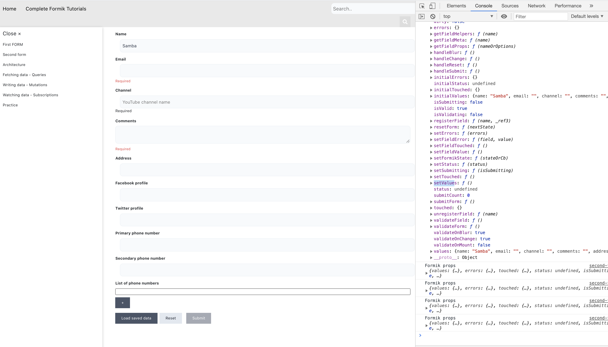
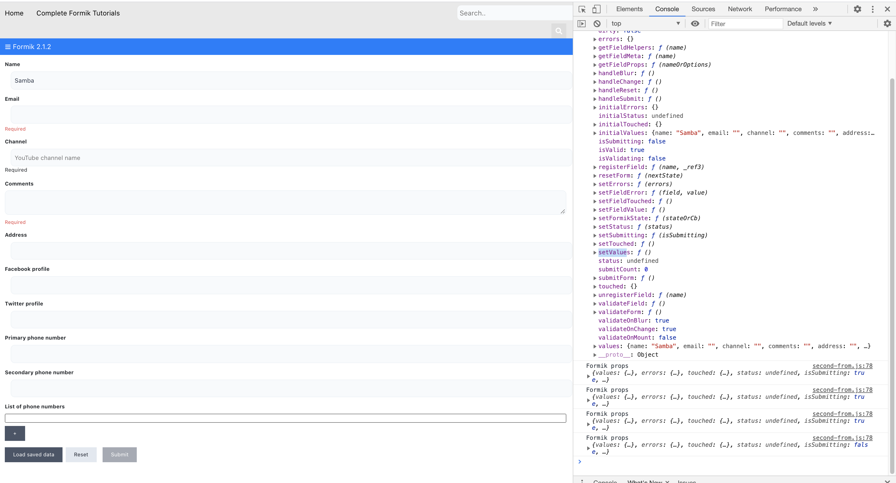
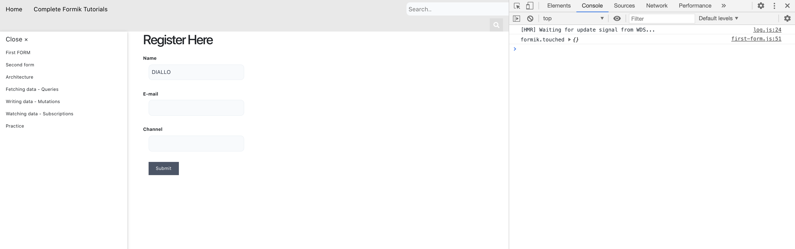
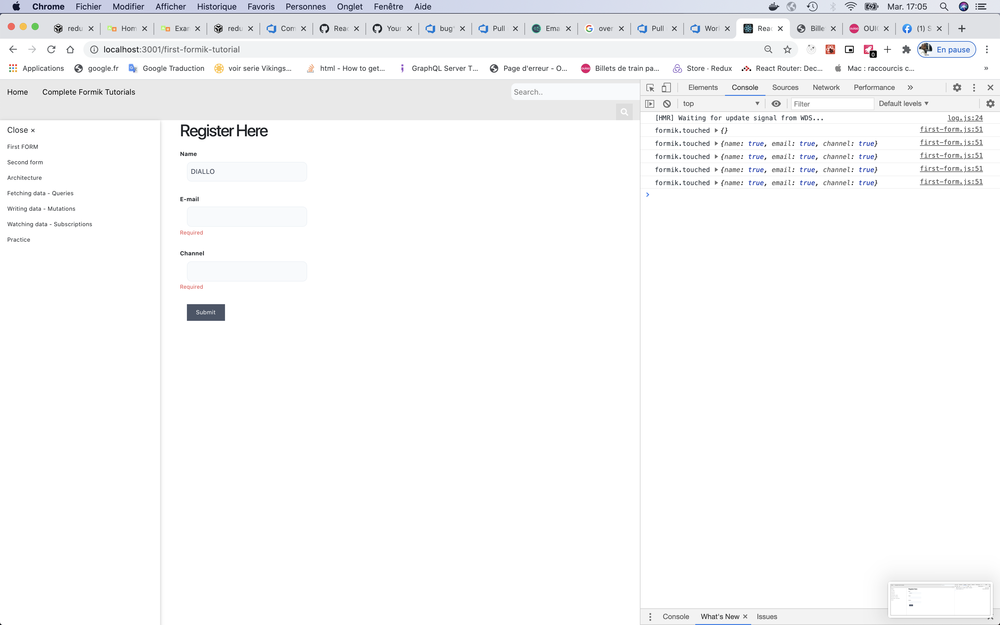
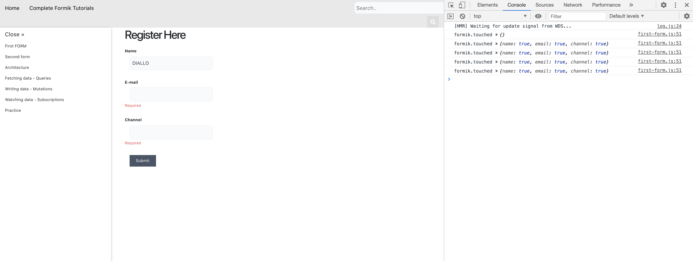
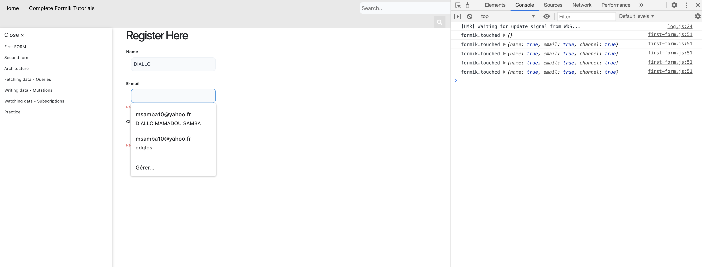
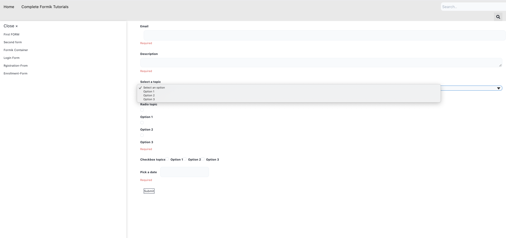
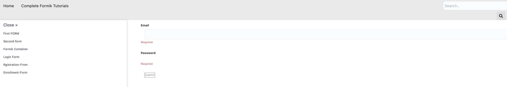
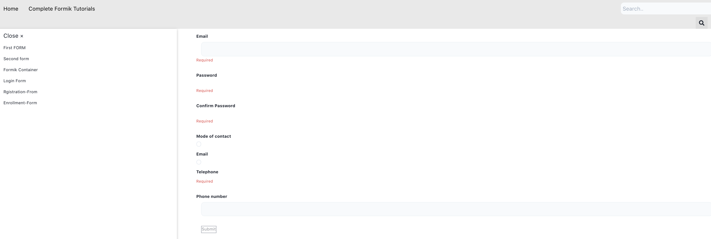
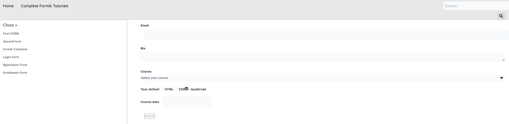

# Getting Started with Create React App

This project was bootstrapped with [Create React App](https://github.com/facebook/create-react-app).

## Available Scripts

In the project directory, you can run:

### `yarn start`

Runs the app in the development mode.\
Open [http://localhost:3000](http://localhost:3000) to view it in the browser.

The page will reload if you make edits.\
You will also see any lint errors in the console.

### `yarn test`

Launches the test runner in the interactive watch mode.\
See the section about [running tests](https://facebook.github.io/create-react-app/docs/running-tests) for more information.

### Before we star
Welcome to the Formik tutorial. This will teach you everything you need to know to build simple and complex forms in React.

###  Overview: What is Formik?

# Screen Shots
    Formik is a small group of React components and hooks for building forms in React and React Native. It helps with the three most annoying parts:

    Getting values in and out of form state
    Validation and error messages
    Handling form submission
    By colocating all of the above in one place, Formik keeps things organized--making testing, refactoring, and reasoning about your forms a breeze.

